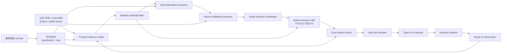

# Interaction-Uncertainty

这是一个面向 Interactive Perception 的研究代码库，目标是把：

```text
prompt-conditioned uncertainty
```

变成：

```text
可定位的信息需求
→ 多个可执行交互原语
→ 动作后的观测分布
→ prompt-specific 风险比较
→ VLA/skill 执行请求
```

当前版本为 `v0.2.0`。它实现的是可学习、可部署模型之间的技术管线和数学决策层；仓库**不包含训练好的 VLM/VLA/effect critic 权重，也不把测试 fixture 冒充方法结果**。真实模型通过严格的 versioned JSON 接口接入，CPU 核心负责 belief filtering、information-need extraction、counterfactual rollout、动作比较、安全检查和 trace。

## 研究问题

用户往往已经明确说出了最终目标，例如：

```text
Place the orange juice in the wicker basket.
```

但当前观测可能不足以直接执行：目标在关闭的冰箱里、被物体遮挡、包装标签背对相机，或者目标在已进行有限搜索后仍未出现。现有 VLA 路线常把“是否探索”交给语言 prompt 隐式推理；传统 POMDP、mechanical search 和 uncertainty-aware planning 又常以全局地图熵、固定 retrieval 目标或有限 push/NBV 动作为中心。

本项目研究二者之间的缺口：

> 如何显式建模由用户 prompt 调制的任务不确定度，并把它转换成可生成、可比较、可执行的 interactive manipulation / information enrichment 原语？

## 非协商问题边界

- 不包含 active viewpoint change、NBV、导航、绕行或独立相机运动原语。
- 信息动作仅限 interactive manipulation 与 information enrichment，例如开门、拉抽屉、移开遮挡、翻开覆盖物、旋转标签、拿近观察。
- policy observation 不允许 simulator semantic/instance ID、ground-truth mask、object pose、MuJoCo body/geom/joint ID、oracle action 或目标真值。
- prompt 只描述最终任务，不泄漏“先开门”“先旋转”“先移障”等探索过程。
- prompt 调制任务投影、信息相关性和 loss；它不能任意改变动作的物理效果。
- effect prediction 只用于动作前排序。执行后真实 belief 只能由真实 execution report 与真实新观测更新。
- 所有物理候选（包括 `DIRECT_ACT`）都必须有 action-effect forecast；只有不执行物理动作的 `STOP_NOT_FOUND` 没有 forecast。
- `DIRECT_ACT` 必须绑定当前公开观测中具有 `task_target` affordance 的 public anchor，不允许用隐式或 privileged target grounding。
- `DIRECT_ACT`、`STOP_NOT_FOUND` 与所有信息动作进入同一个候选池，不能先用一个 uncertainty threshold 强行决定“探索/不探索”。信息动作的 branch 按 `BAYES_AFTER_OBSERVATION` 重新选择终止决策；`DIRECT_ACT` 按 `FIXED_DIRECT_ACT` 评估已承诺直接执行的风险，不借预测观测后改变决策来降低风险。

## v0.2 的核心结构



uncertainty 在系统中进入两次：

1. `BeliefState → InformationNeed → CandidateSet`：回答“缺什么信息、信息在哪里、应该生成哪些可能动作”；
2. `Candidate × Belief → OutcomeForecast → ExpectedTaskRisk`：回答“哪个动作预计最值得执行”。

这避免了两个错误极端：只把 uncertainty 数字写进 VLA prompt，或者把 deficit 直接硬编码成唯一动作。

## 数学接口

用户 prompt 为 \(q\)，policy-visible history 为 \(h_t^{pub}\)，任务隐变量为 \(Z_q\)：

\[
b_t^q(z)=P(Z_q=z\mid h_t^{pub},q).
\]

prompt 定义终止决策集合和损失 \(L_q(d,z)\)。当前 Bayes risk 为：

\[
\rho_q(b_t)=\min_d\sum_zL_q(d,z)b_t^q(z).
\]

evidence model 输出非负 pseudo-evidence，得到：

\[
\boldsymbol\pi_t\sim\operatorname{Dir}(\boldsymbol\alpha_t),
\qquad
\alpha_{t,k}=e_{t,k}+Wa_k.
\]

信息充分度使用 Beta 特例表示。缺少证据的程度同时分解为 predictive entropy、Dirichlet mutual information、vacuity、dissonance 和 localized deficits；这些量不是可互换的同一个“uncertainty”。

对于候选动作 \(a\)，effect critic 不直接伪造 post-belief，而是预测：

\[
T_a(s'\mid s),\qquad Z_a(y\mid s').
\]

系统内部计算：

\[
b^-_a(s')=\sum_sT_a(s'\mid s)b_t(s),
\]

\[
p(y\mid b_t,a)=\sum_{s'}Z_a(y\mid s')b^-_a(s'),
\]

\[
b^+_{a,y}(s')=
\frac{Z_a(y\mid s')b^-_a(s')}{p(y\mid b_t,a)}.
\]

由于 outcome likelihood 对每个 post-state 穷尽归一化，posterior martingale / law of total expectation 自动成立：

\[
\sum_yp(y\mid a)b^+_{a,y}=b^-_a.
\]

对信息动作，branch 风险使用观测后的 Bayes 决策；对 `DIRECT_ACT`，branch 风险始终使用已承诺的 `DIRECT_ACT` loss row。记这两种规则对应的风险为 \(R_q^{\mathrm{rule}}(a,y)\)，则有 effect forecast 的物理候选目标为：

\[
\begin{aligned}
J_q(a)={}&\sum_y p(y\mid b_t,a)R_q^{\mathrm{rule}}(a,y)\\
&+\lambda_c\mathbb E[C_y]
+\lambda_r\mathbb E[R_y]
+\lambda_d\mathbb E[D_y]\\
&+\lambda_u U_{critic}(a)
+\lambda_s\mathbb E[1-P(I_{sufficient}\mid y)].
\end{aligned}
\]

风险分解显式区分“当前可重新选择的 Bayes 决策”和“已承诺的候选决策”。记 `current_bayes_risk` 为 \(\rho_q(b_t)\)，`current_decision_risk` 对信息动作等于 \(\rho_q(b_t)\)，对 `DIRECT_ACT` 或 `STOP_NOT_FOUND` 等于当前 belief 上对应固定 decision row 的风险。因此：

\[
\begin{aligned}
\text{decision commitment penalty}
&=\text{current decision risk}-\text{current Bayes risk}\ge 0,\\
\text{physical progress value}
&=\text{current decision risk}-\text{transition-predictive risk},\\
\text{conditional information value}
&=\text{transition-predictive risk}-\text{expected posterior risk},\\
\text{total task-risk reduction}
&=\text{physical progress value}+\text{conditional information value}
-\text{decision commitment penalty}.
\end{aligned}
\]

`STOP_NOT_FOUND` 不发生物理动作、不使用 forecast，直接按当前 belief 上的 `NOT_FOUND` loss 与 sufficiency penalty 评分；它的 `CandidateValue` 仍显式记录固定 `NOT_FOUND` 相对当前 Bayes 决策的 commitment penalty，而 physical/information value 都为 0。最后在同一候选池选择 \(a^*=\arg\min_aJ_q(a)\)。更完整的符号溯源、哪些量属于前人、哪些组合才可能构成我们的贡献，见 [数学符号与文献溯源](docs/research-symbols-and-prior-art.md)。

## 代码结构

生产主路径位于 `interaction_uncertainty.v2`：

| 功能 | 代码 | 关键对象 |
|---|---|---|
| prompt 与任务损失 | `v2/task.py` | `TaskKey`, `TaskSpec`, `TerminalDecision` |
| 模型证据合同 | `v2/evidence.py` | `EvidencePacket`, `PromptEvidenceModel`, `ModelStamp` |
| 时序 belief | `v2/belief.py` | `BeliefState`, `EvidentialBeliefFilter` |
| uncertainty → 信息需求 | `v2/needs.py` | `InformationNeed`, `BayesRiskNeedExtractor` |
| 信息需求 → typed 候选 | `v2/primitives.py` | `PrimitiveCall`, `NeedDrivenPrimitiveProposer` |
| 动作效果与 Bayes rollout | `v2/effects.py` | `CandidateEffectForecast`, `rollout_forecast` |
| 统一动作比较 | `v2/planning.py` | `PlanningWeights`, `rank_primitives` |
| 有状态闭环 | `v2/controller.py` | `EpisodeController`, `ControllerState` |
| VLA/skill 边界 | `v2/execution.py` | `VLAExecutionRequest`, `ActionChunk`, `ExecutionReport` |
| 远程 GPU 模型 | `v2/remote.py` | `RemoteEvidenceModel`, `RemoteActionOutcomeCritic`, `RemotePolicyBackend` |
| LIBERO 公共观测 | `v2/libero.py` | `LiberoPublicObservationAdapter` |
| 链接式完整性 trace | `v2/trace.py` | hash-linked `TraceEvent`, JSONL sink, `verify_trace_chain` |

共享的稳定数学/安全基础位于：

- `beliefs.py`：Beta、Dirichlet、Subjective Logic 合法域、有限状态 POMDP update；
- `updates.py`：严格 count update、Dirichlet hard-subset → exact Beta projection；
- `uncertainty.py`：entropy、MI、vacuity、dissonance；
- `metrics.py`：NLL、Brier、ECE/MCE；
- `observation.py` 与 `firewall.py`：公共观测和第二道 privilege denylist。

旧代码只是 feasibility-only prototype，不具备当前 belief/effect/value 语义。v0.2 是 clean rewrite：按 frame/prompt 查表的 belief、手写 action-effect branches、静态 proposer 和 YAML“正确动作”demo 已从可安装包中删除，不承诺旧 API、配置、trace 或行为兼容。单元测试中的解析 fixture 只验证数学与接口，不充当模型输出或科学实验结果。

trace 是 hash-linked integrity trace。`verify_trace_chain(events)` 可验证 event identity、content digest 和 parent link，但 JSONL 不是防篡改存储：整链重写、未外部固定的尾部截断或整体删除不能单靠链防止。trace 也不封装模型权重、远程服务、executor 和环境状态，因此不提供完整物理 replay。已有 trace 可用下列命令做结构与哈希链验证：

```bash
interaction-uncertainty verify-trace --trace /tmp/policy-trace.jsonl
```

## 安装

要求 Python >=3.10。CI 覆盖 Python 3.10–3.12；更新的 Python 版本尚未保证兼容。CPU 核心不依赖 PyTorch、JAX、LIBERO、OpenVLA 或 Octo。

当前发布包尚未配置公开 remote repository，因此不要使用 `git clone` placeholder。请直接从已获取的本地源码目录安装：

```bash
cd /absolute/path/to/Interaction-Uncertainty
python3 -m venv .venv
source .venv/bin/activate
python -m pip install --upgrade pip
python -m pip install -e '.[dev]'
```

运行检查：

```bash
ruff check src tests
pytest -q
interaction-uncertainty validate-task \
  --task examples/v2/task_orange_juice.json
```

## 真实模型如何接入

v0.2 把大型模型放在独立 GPU 环境：evidence 与 effect 两个服务负责规划，第三个可选 policy service 只负责把已选原语变成连续动作。

### 1. Evidence service

请求：

```text
POST /v2/evidence
schema_version = interaction-uncertainty.evidence-request.v2
```

输入只包含 `TaskSpec`、最终 prompt 与 public observation。返回：

- 与 `TaskKey` 一致的 hypothesis evidence；
- Beta sufficiency evidence；
- 定位到当前 public anchor 的 deficits；
- observation content digest；
- model/checkpoint/calibrator 标识；
- correlation group。

输出必须满足 [EvidencePacket Schema](schemas/v2/evidence-packet.schema.json)。相同公开内容只改 `frame_id` 时，content digest 和模型证据不能改变；相同 ID 换图像内容时必须改变。

### 2. Action-outcome critic

请求：

```text
POST /v2/effects
schema_version = interaction-uncertainty.effect-request.v2
```

对每个需要 effect forecast 的物理候选返回一个结果。这包括所有信息动作和物理终止动作 `DIRECT_ACT`；只有 `STOP_NOT_FOUND` 不出现在 forecasts 中：

- task hypothesis transition matrix (T_a)；
- 穷尽 observation outcomes 的 likelihood (Z_a)；
- 每个 outcome 的执行状态、成本、风险、扰动和 sufficiency evidence；
- critic 自身的 epistemic/OOD uncertainty；
- model/checkpoint/calibrator 与随机种子。

输出必须满足 [EffectForecast Schema](schemas/v2/effect-forecast.schema.json)。候选不能只返回一个“平均 posterior”再声称具有条件信息价值。

### 3. VLA / skill policy service

请求：

```text
POST /v2/policy
schema_version = interaction-uncertainty.policy-request.v2
```

输入是经过认证的 `VLAExecutionRequest`；输出必须回显同一个 `execution_id`、`candidate_id` 和 primitive family，并返回 [ActionChunk Schema](schemas/v2/action-chunk.schema.json) 定义的连续动作。`ActionChunk` 显式携带 action space、动作维数、normalization statistics ID、backend/checkpoint SHA-256 与随机种子。`RemotePolicyBackend` 还会把这些值与部署配置逐项比较；任何 candidate 偷换、维数错误、未固定 normalization 或 checkpoint 不匹配都会 fail closed。

`STOP_NOT_FOUND` 不执行物理动作，不能请求 action chunk；调用方应直接生成零步终止 report。信息动作执行后必须真实再观测；`DIRECT_ACT` 是物理终止动作，可以请求 action chunk，但执行后 episode 终止。

### 4. 跑一步真实规划管线

evidence 与 effect 两项规划服务启动后：

```bash
interaction-uncertainty plan-remote \
  --task examples/v2/task_orange_juice.json \
  --observation examples/v2/public_observation.json \
  --episode-id libero-episode-0001 \
  --evidence-endpoint http://127.0.0.1:8101/v2/evidence \
  --effect-endpoint http://127.0.0.1:8102/v2/effects \
  --output /tmp/plan.json \
  --trace /tmp/policy-trace.jsonl
```

输出不是连续关节动作，而是一个经过比较的 typed primitive 和 `VLAExecutionRequest`。随后可通过 `RemotePolicyBackend` 接 OpenVLA、Octo、ASA/CoMe-VLA 或现有 skill library；执行后端不得重新决定另一个高层 primitive。

仓库没有随附“看起来能跑”的静态 action oracle。若 evidence/effect 服务缺失、不可达或尚未训练，`plan-remote` 会 fail closed 并以失败结束；它不会等待服务就绪，也不会按场景名、文件名或 frame ID 查表生成答案。

evidence、effect 和 policy endpoints 都应由受信任的部署配置提供，不应直接接受不可信用户输入。生产部署必须限制 scheme/host/port、认证服务身份、重新验证 redirect，并拒绝云 metadata、link-local、loopback 和未授权内网目标，以避免 SSRF 或将 policy 数据发往不可信 endpoint。上面的 `127.0.0.1` 仅是本机开发示例。

## Python API

```python
from interaction_uncertainty.v2 import EpisodeController, EvidentialBeliefFilter
from interaction_uncertainty.v2.remote import (
    RemoteActionOutcomeCritic,
    RemoteEvidenceModel,
    RemotePolicyBackend,
)

controller = EpisodeController(
    task=task_spec,
    episode_id="libero-episode-0001",
    evidence_model=RemoteEvidenceModel("http://127.0.0.1:8101/v2/evidence"),
    belief_filter=EvidentialBeliefFilter(),
    outcome_critic=RemoteActionOutcomeCritic("http://127.0.0.1:8102/v2/effects"),
)

plan = controller.observe_and_plan(public_observation)
policy = RemotePolicyBackend(
    endpoint="http://127.0.0.1:8103/v2/policy",
    expected_action_space="libero_delta_ee_gripper_v1",
    expected_action_dimension=7,
    expected_normalization_stats_id="libero-10-no-noops-v1",
    expected_backend_id="openvla-oft-libero",
    expected_backend_sha256=checkpoint_sha256,
)
action_chunk = policy.generate(plan.execution_request)
execute_bounded_action_chunk(action_chunk)
controller.accept_execution_report(real_execution_report)

# 非终止 primitive 后：
next_plan = controller.observe_and_plan(actual_new_public_observation)
```

controller 在等待 execution report 时拒绝新观测；report 若更换 candidate ID 或 primitive family 会 fail closed；非终止 primitive 的 report 必须要求实际 re-observation。

## LIBERO 接口

`LiberoPublicObservationAdapter` 默认只读取腕部相机：

```python
from interaction_uncertainty.v2.libero import LiberoPublicObservationAdapter

adapter = LiberoPublicObservationAdapter(
    image_keys=("robot0_eye_in_hand_image",),
    anchor_detector=my_deployable_detector_or_tracker,
)

public_observation = adapter.adapt(
    raw_observation=libero_obs,
    frame_id="wrist_t000",
    prompt=task_spec.final_goal_prompt,
)
```

adapter 采用 allowlist，只复制 RGB 与允许的 proprioception。LIBERO 的 `object-state`、目标 pose、semantic ID 或 BDDL 信息即使存在于原始字典中也不会进入 `PolicyObservation`。RGB 引用由真实像素 bytes、dtype 和 shape 的 SHA-256 生成，而不是由 scenario/file name 生成。

默认 publisher 会把图像编码成无损、可校验的 `data:application/x-npy` 引用；因此远程 evidence service 实际收到像素，而不只是一个无法解引用的哈希。若图像较大，可替换 `image_publisher`，上传到 HTTPS/S3 等共享存储；返回 URI 必须携带 adapter 提供的 SHA-256，但这只是声明的期望值，不是内容保证。服务端必须重新获取实际字节，对字节按同一 dtype/shape 合同计算 digest 并与期望 SHA-256 比较；URL 文本里出现 digest 本身不能防止换图。对自定义引用的服务端 fetch 还必须使用 scheme/host allowlist、重新验证 redirect，并限制响应大小、超时和解码资源，以防 SSRF 及不可信内容。服务端可使用 `decode_embedded_public_image` 解码并复核默认引用。单张嵌入图像上限为 16 MiB。

## 如何训练未来两个模型

本仓库暂时不训练，但数据合同已经固定。

Evidence model 的样本：

```text
public before RGB/history + final-goal prompt
→ hypothesis evidence
→ sufficiency evidence
→ localized deficit type/probability/relevance
```

Action-outcome critic 的样本：

```text
public history + pre-action belief + grounded candidate
+ actual execution report + actual next public observation/evidence
→ outcome likelihood / transition / cost / risk / disturbance
```

LIBERO 中可从同一初始 simulator snapshot 克隆多个 episode，分别执行安全候选以获得 counterfactual supervision。snapshot、oracle object state 和 semantic ID 只能用于数据生成 target 与 evaluator，不能作为模型 feature。

推荐先固定解析式 reranker，只训练 evidence model 和 effect critic。否则 evidence、effect 与 action ranking 三层同时学习，实验很难定位贡献。

## 软件验证与科学证据的区别

当前测试可以证明：

- Beta/Dirichlet/POMDP 数学与合法域正确；
- 同一图像改 frame 名不会制造新证据事件；
- public image 内容改变能沿模型合同传播；
- InformationNeed 不包含动作答案；
- candidate grounding、typed parameters 和无 active-viewpoint vocabulary 受约束；
- (T/Z) rollout 满足 posterior martingale；
- candidate 输入顺序不改变解析式目标；
- remote packet、VLA handoff 和 trace 会拒绝常见 privilege 字段；
- 下一步 belief 使用 actual observation，不使用 predicted branch。

当前测试**不能**证明：

- evidence model 在 held-out LIBERO 图像上已校准；
- critic 能准确预测开门、旋转、移障后的真实 outcome；
- learned proposer 具有足够 candidate recall；
- 该方法已提高 benchmark success rate 或 action regret；
- OpenVLA/Octo 已执行成功。

这些必须在下一阶段的 BenchV0/BenchV1 paired-action 数据和服务器实验中验证。

## 开源实现借鉴与许可证

- CNABU/Dengler：借鉴 evidential belief、action-conditioned map/effect prediction 和 post-action information comparison的思想；其根仓库无明确许可证，本项目没有复制其代码、资产或权重，采用 clean-room 实现。
- Act-Sense-Act/CoMe-VLA：其 `TaskStateHead` 是完成状态监督头，flow decoder 是动作实现后端；不是 calibrated uncertainty/VoI router。仓库为 Apache-2.0，当前只做接口层参考。
- `pomdp_py`：MIT，可作为以后长时域 POMDP baseline；v0.2 的一步候选比较不依赖它。
- OpenVLA：代码 MIT、权重另受 Llama 条款；只作为 `PolicyBackend`，需要显式 action dimension 与 normalization statistics。
- Octo：代码 MIT；只作为 action-chunk backend，JAX 环境通过进程/服务隔离。

逐文件实现审计见 [开源仓库实现审计](docs/open-source-implementation-audit.md)，许可证处理见 [代码复用与许可证审计](docs/code-reuse-license-audit.md)。

## 文档

- [v0.2 架构与状态机](docs/architecture.md)
- [数学定义](docs/mathematics.md)
- [数学符号与前人工作溯源](docs/research-symbols-and-prior-art.md)
- [模型与 LIBERO/VLA 集成](docs/integration.md)
- [实验合同](docs/experiment-contract.md)
- [开源仓库实现审计](docs/open-source-implementation-audit.md)
- [代码复用与许可证审计](docs/code-reuse-license-audit.md)

## 当前状态

- 完成：v0.2 typed contracts、stateful controller、belief filter、need extraction、typed proposer、exact (T/Z) rollout、risk reranker、remote model adapters、LIBERO public adapter、VLA request/report、trace 与单元/集成测试。
- 未完成：真实 evidence checkpoint、真实 action-outcome critic、OpenVLA/Octo/ASA executor service、BenchV0 scenarios 的 v0.2 数据重建与主实验。
- 下一步：修 benchmark scenarios，生成同初态多候选 paired outcomes，并开始 far/near、closed/open、rotate/remove 的 evidence/effect calibration 实验。
