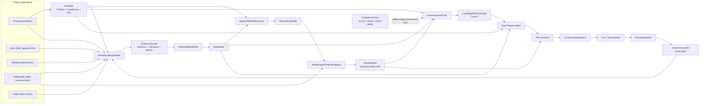
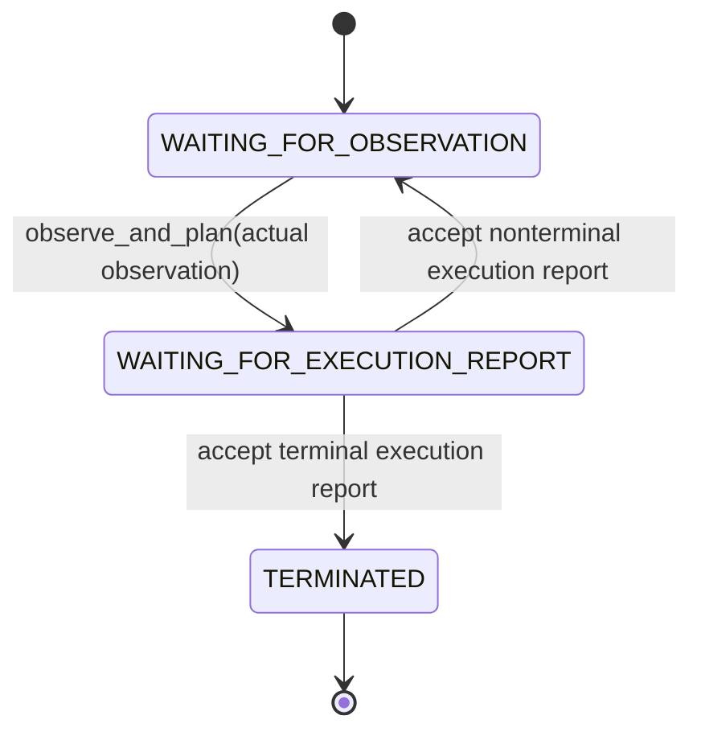
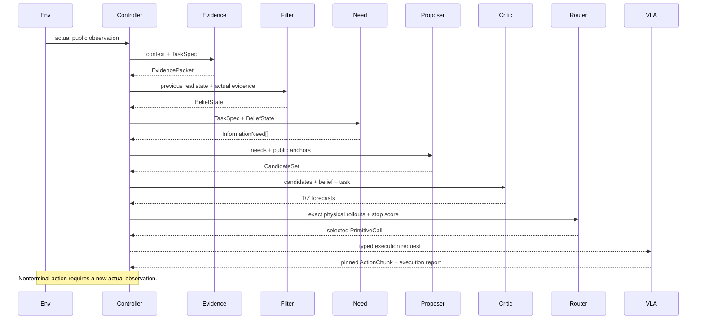

# v0.2 架构与状态机

## 1. 为什么重构

旧代码是 feasibility-only prototype，只验证了候选可行性与基础数据流，没有当前 belief/effect/value 合同。v0.2 是 clean rewrite，不承诺与旧 API、配置、trace 或行为兼容。旧原型没有实现两项最关键的研究模块：

1. 上层 prompt-conditioned uncertainty 如何定位成“缺什么证据、证据在哪里”；
2. 一个动作预计获得什么观测，以及该观测如何改变任务决策。

因此 v0.2 不再以 `frame_id → hand-written belief/effect table` 作为主路径，而是引入：

```text
EvidencePacket
→ BeliefState
→ InformationNeed
→ typed PrimitiveCall
→ transition/observation forecast
→ exact counterfactual rollout
→ task-risk routing
```

旧静态 belief/effect/proposer 与 YAML 正确动作 demo 已从生产包删除。测试只保留输入依赖的解析 fake 与手算概率 fixture，用于验证接口和代数，不充当模型或兼容层。

## 2. 总体数据流



最后一条虚线不是 runtime data edge。privileged 信息只能在完全分离的数据生成/训练-target/evaluator 管线使用；不能进入 policy service request、model feature、trace 或 VLA packet。

## 3. 稳定数据合同

### 3.1 `TaskSpec`

`TaskSpec` 绑定：

- exact final-goal prompt；
- prompt SHA-256；
- ontology ID/version；
- task hypotheses；
- `DIRECT_ACT` 与 `NOT_FOUND` 两个 typed terminal decisions；
- loss matrix (L_q(d,z))；
- base rate 与必要目标属性。

所有 evidence、belief、needs、candidates 和 effects 携带相同 `TaskKey`。prompt 改变必须创建新 task/controller，不能继续累计旧 task belief。

### 3.2 `EvidencePacket`

包含：

```text
schema version
event ID
TaskKey
public observation content digest
hypothesis labels/evidence
sufficiency positive/negative evidence
localized EvidenceDeficit[]
model/checkpoint/calibrator stamp
temporal correlation group
```

它不包含 action recommendation。deficit 只能写 `OCCLUDED_REGION`、`LOW_RESOLUTION`、`UNOBSERVED_SURFACE` 等证据缺口，不能写 `NEED_TO_OPEN` 或 `SHOULD_ROTATE`。

LIBERO 默认 observation adapter 不只发送像素摘要：它发送带 SHA-256 的无损 NumPy data URI，远程模型可实际解码 RGB。外部 image publisher 返回的自定义引用也必须携带同一期望 digest，但 URI/URL 文本包含 digest 不等于验证了内容。服务端必须重新获取字节、按合同重算 digest 并与期望值比较；对这类 fetch 应采用 scheme/host allowlist、redirect 复核、内网/metadata 地址拒绝和严格字节/超时限制，避免 SSRF 与不可信内容。content hash 用于获取后的身份/完整性校验，而不是替代模型所需的视觉内容。

### 3.3 `BeliefState`

包含 prompt-conditioned posterior、evidence event history、content digest、correlation group、filter mode 和 hash-linked history digest。

默认 `REPLACE` 模式适用于高度相关视频帧。`DISCOUNTED_EVIDENCE` 显式使用 retention 与 same-correlation-group discount；它是 neural pseudo-evidence fusion heuristic，不被描述成 exact conjugate Bayes。

相同 observation content、model checkpoint、calibrator 和 task 产生相同 evidence event ID。只改 frame 名不能重新增加 pseudo-count。

### 3.4 `InformationNeed`

表达：

- 哪个 proposition/deficit 仍不确定；
- public anchor；
- deficit kind；
- probability；
- prompt decision relevance；
- 当前最大可降低的 Bayes risk；
- sufficiency shortfall；
- priority 与来源 deficit。

它是 uncertainty 与 action grammar 之间的一等中间层，但不包含 primitive 名称。

### 3.5 `PrimitiveCall`

原语采用 discriminated typed union：

```text
DIRECT_ACT(NoParameters)
STOP_NOT_FOUND(NoParameters)
OPEN_CONTAINER(OpenParameters)
PULL_DRAWER(OpenParameters)
UNCOVER(DisplacementParameters)
CLEAR_OCCLUDER(DisplacementParameters)
PUSH_ASIDE(DisplacementParameters)
BRING_CLOSER(InspectionParameters)
ROTATE_TO_LABEL(RotationParameters)
PICK_AND_INSPECT(InspectionParameters)
```

每个信息动作 call 必须：

- 绑定当前帧未修改的 public anchor；
- 声明其试图解决的 `InformationNeed`；
- 参数具有明确类型、单位和范围；
- 设置可执行的 stop/reobserve condition。

终止 decision 不使用自由字符串：primitive kind 固定映射到 loss row。

`DIRECT_ACT` 虽是终止 decision，却是物理动作：它必须绑定当前、未修改、具有 `task_target` affordance 的 public source anchor，并且必须有 action-effect forecast。`STOP_NOT_FOUND` 不可携带物理 anchor，是唯一不需要 forecast 的候选。

### 3.6 `CandidateEffectForecast`

critic 为每个物理 candidate 返回 forecast，包括信息动作和 `DIRECT_ACT`；`STOP_NOT_FOUND` 没有 forecast：

```text
T_a(s' | s)
ObservationOutcomeModel[]:
    Z_a(y | s')
    execution status
    future sufficiency evidence
    resolved need IDs
    branch cost/risk/disturbance
critic epistemic/OOD uncertainty
model/checkpoint/calibrator/seed
```

`Z` 的 outcomes 对每个 post-state 必须穷尽归一化。失败是一个 branch，不再同时使用外层 feasibility probability，从而避免 double counting。

### 3.7 `CounterfactualRollout`

rollout 用公共公式从 (T/Z) 推导 predictive belief、branch probability 和 posterior。critic 没有接口直接写 post-belief。

信息动作使用 `BAYES_AFTER_OBSERVATION`：每个预测 branch 都允许按该 posterior 重新选择最优终止决策。`DIRECT_ACT` 使用 `FIXED_DIRECT_ACT`：每个 branch 都按已承诺的 `DIRECT_ACT` loss row 计算风险，不允许在预测观测后改变决策。`STOP_NOT_FOUND` 则直接按当前 belief 上的 `NOT_FOUND` loss 评分。

系统记录：

- current Bayes risk；
- current decision risk：信息动作等于 current Bayes risk，`DIRECT_ACT` 等于当前 belief 上的固定 direct-decision 风险；
- decision commitment penalty：`current decision risk - current Bayes risk`，非负；
- transition-predictive risk；
- expected posterior risk；
- physical progress value：`current decision risk - transition-predictive risk`；
- conditional information value：`transition-predictive risk - expected posterior risk`；
- total task-risk reduction：`physical progress + conditional information - commitment penalty`；
- posterior martingale residual；
- predicted sufficiency；
- branch costs/risks/disturbance。

`DIRECT_ACT` 的 physical progress 表示固定 direct 决策下预测物理转移带来的风险变化，不是信息价值。`STOP_NOT_FOUND` 没有 rollout，但它的 `CandidateValue` 仍记录 `NOT_FOUND` 固定 decision row 的 current decision risk 和 commitment penalty；它的 physical progress 与 conditional information value 均为 0，total task-risk reduction 等于承诺惩罚的相反数。

### 3.8 `VLAExecutionRequest` / `ActionChunk` / `ExecutionReport`

VLA request 带 exact selected primitive、anchor、typed parameters、belief summary、step budget、timeout 和 re-observation contract。executor report 必须 echo execution ID、candidate ID 和 primitive family；任何不一致都会 fail closed。

## 4. EpisodeController 状态机



`observe_and_plan` 内部阶段：



预测 branches 永远不会写入 `_belief`。只有下一次 evidence model 对实际观测的输出可以更新真实 state。

## 5. Candidate proposal 与 final selection 分离

`NeedDrivenPrimitiveProposer` 是透明的 registry baseline：根据 deficit type 和 public affordance 产生多个可能 families，并合并同一 anchor/family 所解决的 needs。它以 recall 为目标，不是 proposed learned top-1 policy。

未来 VLM proposer 应与 registry proposer 取并集：

```text
registry candidates
UNION learned/VLM candidates
→ strict schema
→ current-anchor binding
→ typed parameter validation
→ semantic deduplication
→ effect critic
→ risk reranker
```

这既保留生成性，也避免 VLM 漏掉显而易见的安全候选。

## 6. Hash-linked integrity trace 与受限 replay

controller 按正常写入路径产生 hash-linked events：

```text
ObservationReceived
EvidenceProduced
BeliefUpdated
InformationNeedsExtracted
CandidatesProposed
EffectsForecast
RankingComputed
CommandIssued
ExecutionFinished
```

每个 event 的 ID 是 parent、task、step、event type 和 policy-visible payload 的 canonical digest；独立 `content_digest` 还覆盖 schema version 与 UTC timestamp。`verify_trace_chain(events)` 可检查 identity、内容和 parent link。JSONL trace 不包含 evaluator-private 字段。

这是 hash-linked integrity trace，不是防篡改存储或完整 replay 保证。能同时改写 trace 和新哈希的攻击者仍可重建链；未另外固定或签名的尾部截断/整体删除也无法单靠链检出。此外，trace 不封装模型权重、外部服务、执行器和环境状态，所以单凭 JSONL 不能完整重现物理 episode。

后续 replay 模式：

- exact recompute（条件性）：另外固定代码、模型、calibrator、seed 和所有外部输出后，从 public observation 重新运行；
- frozen model output：固定 evidence/candidates/effects，只重跑 filter/router 消融；
- counterfactual rerank：同一 forecast set 比较 loss/weights，不把未执行动作当成真实 outcome。

## 7. 训练与推理边界

| 模块 | 训练时可用 target | 推理 feature | privileged 是否可进入 feature |
|---|---|---|---|
| Evidence model | identity/presence/readability/occlusion truth | public RGB、prompt、public tracks/history | 否 |
| Belief filter | public evidence sequences | prior public state、actual evidence/report | 否 |
| Need extractor | 不训练 | TaskSpec、BeliefState | 否 |
| Candidate proposer | safe candidate annotations、oracle best candidate作 target | public affordance、needs、belief | 否 |
| Outcome critic | cloned before/action/after outcomes | public state、每个物理 candidate（含 `DIRECT_ACT`）、belief | 否；private only target |
| Reranker | v0.2 不训练 | analytic forecast/loss/weights | 否 |
| VLA executor | manipulation/action datasets | selected typed call + public vision/proprio | 否 |
| Evaluator | simulator truth | episode records | 可以，但物理隔离 |

## 8. 仍未实现的部分

- learned prompt evidence checkpoint；
- learned action-outcome critic；
- cross-frame deployable tracker/world memory；
- learned/VLM candidate proposer；
- OpenVLA/Octo/ASA continuous executor；
- long-horizon POMDP/POUCT baseline；
- evaluator-private trace/schema 与 BenchV1 paired-action dataset。

这些不是被 deterministic fixture“代替”了，而是下一阶段明确需要实现和测量的模块。
